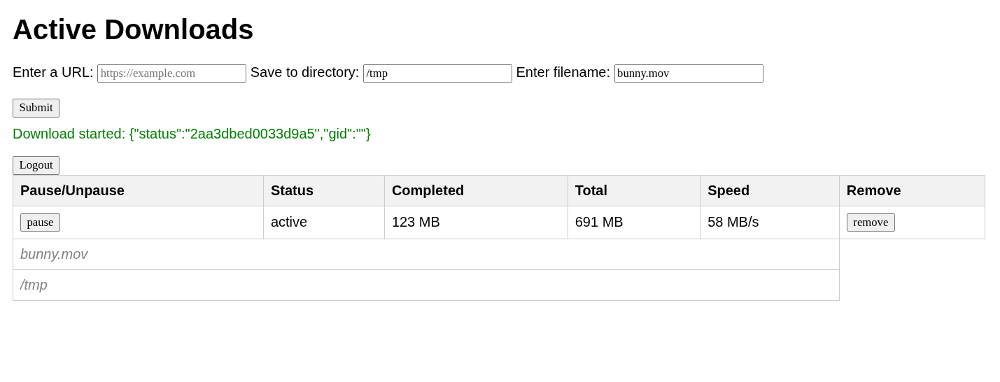

# Goaria

Goaria is a simple server, web UI, and runner for **aria2c**. It is written in **Golang + JavaScript**. The app runs as a standalone binary for convenience.
The app is a work in progress and is quite barebones. Styling is minimal, but basic features are functional.



---

## Todos

The app works in principle, but the code needs refactoring and some features still need to be added. Here are a few things planned for the near future:

- [ ] Split the embedded `index.html` into multiple files
- [ ] Refactor and simplify the JavaScript code
- [ ] Display free disk space in the web UI
- [ ] Add environment variables or program arguments for settings such as the password

---

## How to run

⚠️ **Default password:** `password` and app runs on port :`44444`

```bash
go run main.go
```
or

```bash
go build && ./goaria
```
